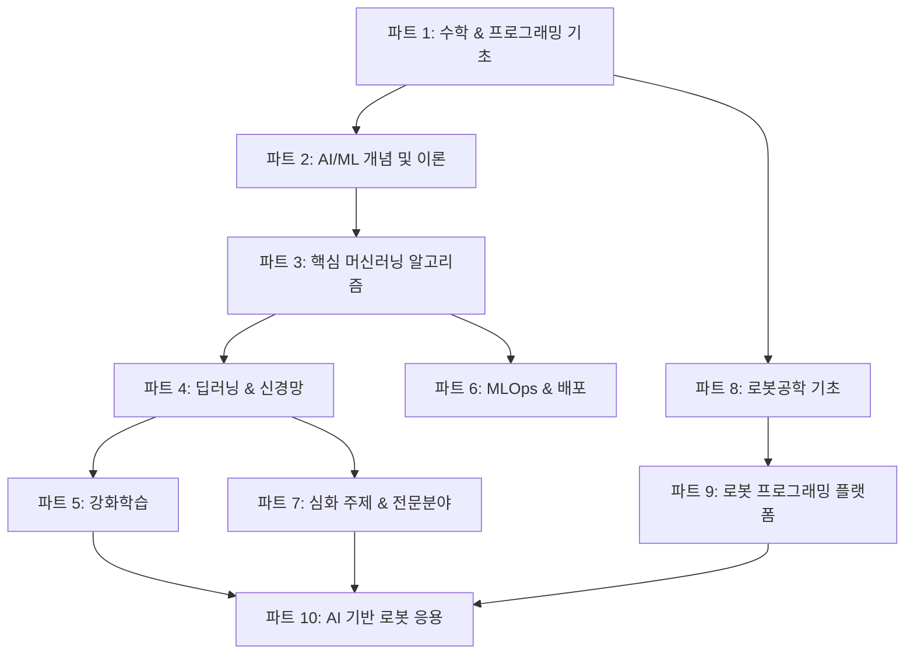

# 🤖 AI/ML 및 로봇공학 마스터 커리큘럼
## *Complete Learning Path to Artificial Intelligence, Machine Learning & Robotics*

[](https://opensource.org/licenses/MIT)
[](README.md)
[](README.md)

---

## 📋 목차 (Table of Contents)

1. [🎯 학습 로드맵 개요](#-학습-로드맵-개요)
2. [🏗️ 커리큘럼 구조](#️-커리큘럼-구조)
3. [📚 파트별 상세 커리큘럼](#-파트별-상세-커리큘럼)
4. [🎓 학습 방법론](#-학습-방법론)
5. [💡 실습 및 프로젝트](#-실습-및-프로젝트)
6. [🛠️ 필수 도구 및 환경](#️-필수-도구-및-환경)
7. [📊 학습 진도 관리](#-학습-진도-관리)
8. [🌐 추가 리소스](#-추가-리소스)

---

## 🎯 학습 로드맵 개요

이 저장소는 **AI/ML 초보자부터 로봇공학 전문가까지**의 완전한 학습 여정을 제공합니다. 체계적이고 단계적인 접근을 통해 현대 AI 기술의 모든 핵심 영역을 마스터할 수 있도록 설계되었습니다.

### 🎯 학습 목표
- **수학적 기초 확립**: 선형대수, 미적분, 확률/통계, 최적화 이론
- **프로그래밍 실력 향상**: Python, 데이터 구조, 알고리즘, 머신러닝 프레임워크
- **핵심 ML 알고리즘 이해**: 지도/비지도학습, 앙상블 방법, 평가 지표
- **딥러닝 전문성 개발**: CNN, RNN, Transformer, 생성 모델, GNN
- **강화학습 마스터**: MDP, Q-Learning, Policy Gradient, Actor-Critic
- **MLOps 실무 역량**: 모델 배포, 모니터링, CI/CD, 데이터 파이프라인
- **로봇공학 통합 지식**: 운동학, 동역학, 제어, ROS, 자율주행, 매니퓰레이션

### 🎓 대상 학습자
- **초급자**: 프로그래밍 기초 지식이 있는 AI/ML 입문자
- **중급자**: 기본적인 ML 지식을 가지고 있으나 체계적인 심화 학습을 원하는 개발자
- **고급자**: 특정 분야의 전문성을 키우고 싶은 AI/ML 엔지니어 및 연구자

---

## 🏗️ 커리큘럼 구조

### 📊 전체 구조 다이어그램


### 📈 난이도 및 학습 순서
- **기초 (Foundation)**: 파트 1-2 → 수학적 기초 및 이론적 배경 구축
- **핵심 (Core)**: 파트 3-5 → 주요 AI/ML 알고리즘과 기법 습득
- **실무 (Practical)**: 파트 6 → 실제 배포 및 운영 경험
- **심화 (Advanced)**: 파트 7 → 전문 분야별 깊이 있는 학습
- **응용 (Application)**: 파트 8-10 → 로봇공학과의 통합 및 실제 적용

### ⏱️ 예상 학습 시간
- **전체 커리큘럼**: 12-18개월 (주 15-20시간 학습 기준)
- **기초 단계 (파트 1-2)**: 2-3개월
- **핵심 단계 (파트 3-5)**: 4-6개월
- **실무 단계 (파트 6)**: 1-2개월
- **심화/응용 단계 (파트 7-10)**: 5-7개월

---

## 📚 파트별 상세 커리큘럼

### 🧮 **파트 1: AI/ML을 위한 수학 & 프로그래밍 기초**
<details>
<summary><strong>1.1. 수학 (Mathematics)</strong></summary>

#### 1.1.1. 선형대수 (Linear Algebra)
- [x] [스칼라, 벡터, 행렬, 텐서의 이해](./docs/01_01_01_Scalar_Vector_Matrix_Tensor.md)
- [x] [행렬 연산 (덧셈, 뺄셈, 곱셈, 전치)](./docs/01_01_02_Matrix_Operations.md)
- [x] [내적과 외적](./docs/01_01_03_Dot_Product_and_Cross_Product.md)
- [x] [단위행렬과 역행렬](./docs/01_01_04_Identity_and_Inverse_Matrix.md)
- [x] [행렬식](./docs/01_01_05_Determinant.md)
- [x] [고유값과 고유벡터](./docs/01_01_06_Eigenvalues_and_Eigenvectors.md)
- [x] [특이값 분해 (SVD)](./docs/01_01_07_Singular_Value_Decomposition.md)
- [x] [주성분 분석 기초](./docs/01_01_08_Principal_Component_Analysis.md)

#### 1.1.2. 미적분 (Calculus)
- [ ] [극한과 연속](./docs/01_02_01_Limits_and_Continuity.md)
- [ ] [미분과 미분계수](./docs/01_02_02_Derivatives.md)
- [ ] [편미분](./docs/01_02_03_Partial_Derivatives.md)
- [ ] [연쇄 법칙](./docs/01_02_04_Chain_Rule.md)
- [ ] [그래디언트](./docs/01_02_05_Gradient.md)
- [ ] [적분](./docs/01_02_06_Integrals.md)
- [ ] [활성화 함수의 미분](./docs/01_02_07_Activation_Function_Derivatives.md)

#### 1.1.3. 확률 및 통계 (Probability & Statistics)
- [ ] [기본 확률 이론](./docs/01_03_01_Basic_Probability_Theory.md)
- [ ] [베이즈 정리](./docs/01_03_02_Bayes_Theorem.md)
- [ ] [확률 변수](./docs/01_03_03_Random_Variables.md)
- [ ] [확률 분포](./docs/01_03_04_Probability_Distributions.md)
- [ ] [기댓값, 분산, 표준편차](./docs/01_03_05_EV_Variance_StdDev.md)
- [ ] [중심극한정리](./docs/01_03_06_Central_Limit_Theorem.md)
- [ ] [기술 통계](./docs/01_03_07_Descriptive_Statistics.md)
- [ ] [추론 통계](./docs/01_03_08_Inferential_Statistics.md)
- [ ] [최대 가능도 추정 (MLE)](./docs/01_03_09_Maximum_Likelihood_Estimation.md)

#### 1.1.4. 최적화 (Optimization)
- [ ] [비용/손실 함수](./docs/01_04_01_Cost_Loss_Function.md)
- [ ] [경사 하강법과 변형](./docs/01_04_02_Gradient_Descent.md)
- [ ] [볼록 최적화](./docs/01_04_03_Convex_Optimization.md)
- [ ] [라그랑주 승수법](./docs/01_04_04_Lagrange_Multipliers.md)

</details>

<details>
<summary><strong>1.2. 컴퓨터 과학 & 프로그래밍</strong></summary>

#### 1.2.1. Python 프로그래밍 기초
- [ ] [기본 문법과 자료형](./docs/01_05_01_Python_Syntax.md)
- [ ] [제어문](./docs/01_05_02_Control_Flow.md)
- [ ] [함수와 모듈](./docs/01_05_03_Functions_Modules.md)
- [ ] [객체지향 프로그래밍](./docs/01_05_04_OOP_Basics.md)
- [ ] [파일 입출력](./docs/01_05_05_File_IO.md)

#### 1.2.2. 필수 라이브러리
- [ ] [NumPy: 수치 연산](./docs/01_05_06_Numpy.md)
- [ ] [Pandas: 데이터 처리](./docs/01_05_07_Pandas.md)
- [ ] [Matplotlib/Seaborn: 시각화](./docs/01_05_08_Matplotlib_Seaborn.md)

#### 1.2.3. 자료구조 & 알고리즘
- [ ] [복잡도 분석](./docs/01_06_01_Complexity.md)
- [ ] [기본 자료구조](./docs/01_06_02_Basic_Data_Structures.md)
- [ ] [고급 자료구조](./docs/01_06_03_Advanced_Data_Structures.md)
- [ ] [정렬 알고리즘](./docs/01_06_04_Sorting_Algorithms.md)
- [ ] [탐색 알고리즘](./docs/01_06_05_Searching_Algorithms.md)
- [ ] [그래프 순회](./docs/01_06_06_Graph_Traversal.md)

</details>

### 🧠 **파트 2: 인공지능 & 머신러닝 소개**
<details>
<summary><strong>AI의 역사와 개념</strong></summary>

- [ ] [AI의 역사와 발전](./docs/02_01_01_Turing_Test_and_Birth_of_AI.md)
- [ ] [AI, ML, DL의 관계](./docs/02_02_01_Relationship_AI_ML_DL.md)
- [ ] [머신러닝의 종류](./docs/02_03_01_Supervised_Learning.md)
- [ ] [ML 워크플로우](./docs/02_04_01_ML_Workflow.md)

</details>

### 🎯 **파트 3: 핵심 머신러닝 알고리즘**
<details>
<summary><strong>3.1. 지도학습 (Supervised Learning)</strong></summary>

#### 회귀 (Regression)
- [ ] [선형 회귀](./docs/03_01_01_Linear_Regression.md)
- [ ] [다항 회귀](./docs/03_01_01_Polynomial_Regression.md)
- [ ] [규제 회귀 (Ridge, Lasso, ElasticNet)](./docs/03_01_01_Regularized_Regression.md)

#### 분류 (Classification)
- [ ] [로지스틱 회귀](./docs/03_01_02_Logistic_Regression.md)
- [ ] [k-최근접 이웃 (k-NN)](./docs/03_01_02_kNN.md)
- [ ] [서포트 벡터 머신 (SVM)](./docs/03_01_02_SVM.md)
- [ ] [결정 트리](./docs/03_01_02_Decision_Trees.md)
- [ ] [나이브 베이즈](./docs/03_01_02_Naive_Bayes.md)

#### 앙상블 학습 (Ensemble Learning)
- [ ] [보팅과 배깅](./docs/03_01_03_Voting_and_Bagging.md)
- [ ] [랜덤 포레스트](./docs/03_01_03_Random_Forest.md)
- [ ] [부스팅 (AdaBoost, XGBoost, LightGBM)](./docs/03_01_03_Boosting.md)

</details>

<details>
<summary><strong>3.2. 비지도학습 (Unsupervised Learning)</strong></summary>

#### 클러스터링 (Clustering)
- [ ] [K-평균 클러스터링](./docs/03_02_01_K-Means_Clustering.md)
- [ ] [계층적 클러스터링](./docs/03_02_01_Hierarchical_Clustering.md)
- [ ] [DBSCAN](./docs/03_02_01_DBSCAN.md)

#### 차원 축소 (Dimensionality Reduction)
- [ ] [주성분 분석 (PCA)](./docs/03_02_02_PCA.md)
- [ ] [t-SNE](./docs/03_02_02_t-SNE.md)

</details>

<details>
<summary><strong>3.3. 모델 평가 & 성능 향상</strong></summary>

- [ ] [과적합/과소적합](./docs/03_03_01_Over_Under_Fitting.md)
- [ ] [편향-분산 트레이드오프](./docs/03_03_02_Bias_Variance_Tradeoff.md)
- [ ] [교차 검증](./docs/03_03_03_Cross_Validation.md)
- [ ] [회귀 평가 지표](./docs/03_03_02_Regression_Metrics.md)
- [ ] [분류 평가 지표](./docs/03_03_03_Classification_Metrics.md)

</details>

### 🧠 **파트 4: 딥러닝 & 신경망**
<details>
<summary><strong>4.1. 신경망 기초</strong></summary>

- [ ] [퍼셉트론과 다층 퍼셉트론](./docs/04_01_01_Perceptron_and_MLP.md)
- [ ] [활성화 함수](./docs/04_01_02_Activation_Functions.md)
- [ ] [손실 함수](./docs/04_01_03_Loss_Functions.md)
- [ ] [역전파 알고리즘](./docs/04_01_04_Backpropagation.md)
- [ ] [최적화 알고리즘](./docs/04_01_05_Optimizers.md)

</details>

<details>
<summary><strong>4.2. 딥러닝 학습 기술</strong></summary>

- [ ] [가중치 초기화](./docs/04_02_01_Weight_Initialization.md)
- [ ] [배치 정규화](./docs/04_02_02_Batch_Normalization.md)
- [ ] [드롭아웃](./docs/04_02_03_Dropout.md)
- [ ] [학습률 스케줄링](./docs/04_02_04_Learning_Rate_Scheduling.md)

</details>

<details>
<summary><strong>4.3. 합성곱 신경망 (CNN)</strong></summary>

- [ ] [CNN 핵심 구성요소](./docs/04_03_01_CNN_Components.md)
- [ ] [주요 CNN 아키텍처](./docs/04_03_02_CNN_Architectures.md)
- [ ] [CNN 응용 분야](./docs/04_03_03_CNN_Applications.md)

</details>

<details>
<summary><strong>4.4. 순환 신경망 (RNN)</strong></summary>

- [ ] [순차 데이터 이해](./docs/04_04_01_Sequential_Data.md)
- [ ] [RNN과 한계](./docs/04_04_02_RNN_and_Limits.md)
- [ ] [LSTM](./docs/04_04_03_LSTM.md)
- [ ] [GRU](./docs/04_04_04_GRU.md)
- [ ] [양방향 RNN](./docs/04_04_05_Bidirectional_RNN.md)
- [ ] [RNN 응용](./docs/04_04_06_RNN_Applications.md)

</details>

<details>
<summary><strong>4.5. 트랜스포머 & 어텐션</strong></summary>

- [ ] [어텐션 메커니즘](./docs/04_05_01_Attention_Mechanism.md)
- [ ] [트랜스포머 아키텍처](./docs/04_05_02_Transformer_Architecture.md)
- [ ] [주요 트랜스포머 모델](./docs/04_05_03_Transformer_Models.md)
- [ ] [트랜스포머 응용](./docs/04_05_04_Transformer_Applications.md)

</details>

<details>
<summary><strong>4.6. 생성 모델</strong></summary>

- [ ] [오토인코더](./docs/04_06_01_Autoencoders.md)
- [ ] [변이형 오토인코더 (VAE)](./docs/04_06_02_Variational_Autoencoders.md)
- [ ] [생성적 적대 신경망 (GAN)](./docs/04_06_03_GANs.md)
- [ ] [디퓨전 모델](./docs/04_06_04_Diffusion_Models.md)
- [ ] [생성 모델 응용](./docs/04_06_05_Generative_Applications.md)

</details>

<details>
<summary><strong>4.7. 그래프 신경망 (GNN)</strong></summary>

- [ ] [그래프 데이터 이해](./docs/04_07_01_Graph_Data.md)
- [ ] [GNN 기본 원리](./docs/04_07_02_GNN_Principles.md)
- [ ] [주요 GNN 아키텍처](./docs/04_07_03_GNN_Architectures.md)
- [ ] [GNN 응용](./docs/04_07_04_GNN_Applications.md)

</details>

### 🎮 **파트 5: 강화학습 (Reinforcement Learning)**
<details>
<summary><strong>5.1. 강화학습 기초</strong></summary>

- [ ] [핵심 구성요소](./docs/05_01_01_Key_Components.md)
- [ ] [정책](./docs/05_01_02_Policy.md)
- [ ] [가치 함수](./docs/05_01_03_Value_Function.md)
- [ ] [모델](./docs/05_01_04_Model.md)
- [ ] [탐험 vs 활용](./docs/05_01_05_Exploration_vs_Exploitation.md)

</details>

<details>
<summary><strong>5.2. 마르코프 결정 과정 (MDP)</strong></summary>

- [ ] [마르코프 결정 과정](./docs/05_02_01_Markov_Decision_Processes.md)
- [ ] [벨만 방정식](./docs/05_02_02_Bellman_Equations.md)

</details>

<details>
<summary><strong>5.3. 주요 강화학습 알고리즘</strong></summary>

- [ ] [모델 프리 학습](./docs/05_03_01_Model_Free_Learning.md)
- [ ] [가치 기반 학습](./docs/05_03_02_Value_Based_Learning.md)
- [ ] [정책 기반 학습](./docs/05_03_03_Policy_Based_Learning.md)
- [ ] [액터-크리틱 방법](./docs/05_03_04_Actor_Critic_Methods.md)

</details>

### ⚙️ **파트 6: MLOps (머신러닝 운영)**
<details>
<summary><strong>실무 MLOps</strong></summary>

- [ ] [MLOps 개요](./docs/06_01_Introduction_to_MLOps.md)
- [ ] [데이터 및 피처 관리](./docs/06_02_Data_and_Feature_Management.md)
- [ ] [모델 배포 및 서빙](./docs/06_03_Model_Deployment_and_Serving.md)
- [ ] [CI/CD/CT for ML](./docs/06_04_CI_CD_CT_for_ML.md)
- [ ] [모델 모니터링 및 관리](./docs/06_05_Model_Monitoring_and_Management.md)

</details>

### 🚀 **파트 7: 심화 주제 & 전문분야**
<details>
<summary><strong>7.1. 자연어 처리 심화</strong></summary>

- [ ] [텍스트 임베딩](./docs/07_01_01_Text_Embeddings.md)
- [ ] [주요 NLP 과제](./docs/07_01_02_NLP_Tasks.md)

</details>

<details>
<summary><strong>7.2. 컴퓨터 비전 심화</strong></summary>

- [ ] [전이 학습과 미세 조정](./docs/07_02_01_Transfer_Learning_and_Fine_tuning.md)
- [ ] [이미지 생성과 스타일 변환](./docs/07_02_02_Image_Generation_and_Style_Transfer.md)
- [ ] [고급 세그멘테이션](./docs/07_02_03_Advanced_Segmentation.md)
- [ ] [3D 비전](./docs/07_02_04_3D_Vision.md)
- [ ] [비디오 분석](./docs/07_02_05_Video_Analysis.md)

</details>

<details>
<summary><strong>7.3. 추천 시스템</strong></summary>

- [ ] [콘텐츠 기반 필터링](./docs/07_03_01_Content_Based_Filtering.md)
- [ ] [협업 필터링](./docs/07_03_02_Collaborative_Filtering.md)
- [ ] [딥러닝 기반 추천](./docs/07_03_03_Deep_Learning_based_Recommender_Systems.md)
- [ ] [하이브리드 모델](./docs/07_03_04_Hybrid_Models.md)

</details>

<details>
<summary><strong>7.4. 시계열 분석</strong></summary>

- [ ] [전통적 시계열 모델](./docs/07_04_01_Traditional_Time_Series_Models.md)
- [ ] [딥러닝 기반 시계열](./docs/07_04_02_Deep_Learning_based_Time_Series_Models.md)
- [ ] [기타 시계열 모델](./docs/07_04_03_Other_Time_Series_Models.md)

</details>

<details>
<summary><strong>7.5. 책임감 있는 AI</strong></summary>

- [ ] [편향성과 공정성](./docs/07_05_01_Bias_and_Fairness_in_AI.md)
- [ ] [설명 가능한 AI (XAI)](./docs/07_05_02_Explainable_AI_XAI.md)
- [ ] [프라이버시 보호](./docs/07_05_03_Privacy_in_AI.md)
- [ ] [AI 안전성](./docs/07_05_04_AI_Safety.md)

</details>

### 🤖 **파트 8: 로봇공학 기초**
<details>
<summary><strong>8.1-8.5 로봇 시스템 기초</strong></summary>

- [ ] [로봇 시스템 소개](./docs/08_01_01_Robot_Definition_Types_Components.md)
- [ ] [좌표계와 변환](./docs/08_01_02_Coordinate_Systems_Transformations.md)
- [ ] [자유도](./docs/08_01_03_Degrees_of_Freedom.md)
- [ ] [순기구학](./docs/08_02_01_Forward_Kinematics.md)
- [ ] [역기구학](./docs/08_02_02_Inverse_Kinematics.md)
- [ ] [자코비안](./docs/08_02_03_Jacobian.md)
- [ ] [라그랑주 동역학](./docs/08_03_01_Lagrangian_Dynamics.md)
- [ ] [뉴턴-오일러 공식](./docs/08_03_02_Newton_Euler_Formulation.md)
- [ ] [선형 제어 시스템](./docs/08_04_01_Linear_Control_Systems.md)
- [ ] [PID 제어](./docs/08_04_02_PID_Control.md)
- [ ] [궤적 추종 제어](./docs/08_04_03_Trajectory_Tracking_Control.md)
- [ ] [힘 제어와 임피던스 제어](./docs/08_04_04_Force_Impedance_Control.md)
- [ ] [로봇 센서](./docs/08_05_01_Robot_Sensors.md)
- [ ] [로봇 액추에이터](./docs/08_05_02_Robot_Actuators.md)

</details>

### 💻 **파트 9: 로봇 프로그래밍 플랫폼**
<details>
<summary><strong>9.1-9.3 프로그래밍 환경</strong></summary>

- [ ] [ROS 1 vs ROS 2](./docs/09_01_01_ROS1_vs_ROS2.md)
- [ ] [ROS 2 핵심 개념](./docs/09_01_02_ROS2_Core_Concepts.md)
- [ ] [개발 환경 구축](./docs/09_01_03_Development_Environment.md)
- [ ] [TF 변환 라이브러리](./docs/09_01_04_TF.md)
- [ ] [URDF 로봇 모델링](./docs/09_01_05_URDF.md)
- [ ] [Gazebo 시뮬레이션](./docs/09_02_01_Gazebo.md)
- [ ] [NVIDIA Isaac Sim](./docs/09_02_02_NVIDIA_Isaac_Sim.md)
- [ ] [기타 시뮬레이터](./docs/09_02_03_Other_Simulators.md)
- [ ] [마이크로컨트롤러 (MCU)](./docs/09_03_01_MCU.md)
- [ ] [싱글 보드 컴퓨터 (SBC)](./docs/09_03_02_SBC.md)
- [ ] [실시간 운영체제 (RTOS)](./docs/09_03_03_RTOS.md)

</details>

### 🚗 **파트 10: AI 기반 로봇 응용**
<details>
<summary><strong>10.1-10.4 실제 로봇 응용</strong></summary>

#### 자율 이동 로봇 & 자율주행
- [ ] [인식 (Perception)](./docs/10_01_01_Perception.md)
- [ ] [위치 추정 및 매핑 (SLAM)](./docs/10_01_02_Localization_and_Mapping.md)
- [ ] [경로 및 모션 계획](./docs/10_01_03_Path_and_Motion_Planning.md)
- [ ] [자율주행 심화](./docs/10_01_04_Advanced_Autonomous_Driving.md)

#### 로봇 매니퓰레이션
- [ ] [파지 (Grasping)](./docs/10_02_01_Grasping.md)
- [ ] [작업 계획](./docs/10_02_02_Task_Planning.md)
- [ ] [AI 기반 제어](./docs/10_02_03_AI_based_Control.md)

#### 항공 로보틱스
- [ ] [드론 동역학과 제어](./docs/10_03_01_Drone_Dynamics_and_Control.md)
- [ ] [항법과 궤적 추종](./docs/10_03_02_Navigation_and_Trajectory_Tracking.md)
- [ ] [비전 기반 자율 비행](./docs/10_03_03_Visual_Servoing.md)
- [ ] [다중 드론 시스템](./docs/10_03_04_Multi_drone_Systems.md)

#### 휴머노이드 & 다리 로봇
- [ ] [보행 패턴 생성](./docs/10_04_01_Gait_Generation.md)
- [ ] [전신 동역학 제어](./docs/10_04_02_Whole_Body_Control.md)
- [ ] [균형 제어 (ZMP)](./docs/10_04_03_Balance_Control_ZMP.md)
- [ ] [강화학습 기반 동작](./docs/10_04_04_RL_based_Motion.md)

</details>

---

## 🎓 학습 방법론

### 📖 효과적인 학습 전략
1. **단계적 접근**: 기초부터 차근차근, 선수 지식 확인 후 다음 단계 진행
2. **이론과 실습 병행**: 개념 이해 후 반드시 코딩 실습으로 체화
3. **프로젝트 기반 학습**: 각 파트 완료 후 종합 프로젝트 수행
4. **복습과 연결**: 이전 개념과의 연관성 파악, 정기적 복습

### 💡 학습 팁
- **수학 기초 중요성**: 파트 1의 수학 개념이 모든 후속 학습의 기반
- **실습 환경 구축**: Google Colab, Jupyter Notebook 활용 권장
- **커뮤니티 활용**: 스터디 그룹 참여, 온라인 포럼 활용
- **문제 해결 중심**: 단순 암기보다는 원리 이해와 응용에 집중

### 📊 자가 진단 체크리스트
각 파트 학습 후 다음을 확인하세요:
- [ ] 핵심 개념을 자신의 언어로 설명할 수 있는가?
- [ ] 관련 수식을 유도하고 의미를 설명할 수 있는가?
- [ ] 실제 코드로 구현하고 결과를 해석할 수 있는가?
- [ ] 실무 사례에 적용할 수 있는 아이디어가 있는가?

---

## 💡 실습 및 프로젝트

### 🛠️ 파트별 핵심 프로젝트
1. **기초 단계**: 수학 함수 구현, 데이터 분석 프로젝트
2. **ML 기초**: Kaggle 경진대회 참여, 분류/회귀 프로젝트
3. **딥러닝**: 이미지 분류, 자연어 처리, 시계열 예측
4. **강화학습**: 게임 AI, 트레이딩 봇 구현
5. **MLOps**: 모델 배포 파이프라인 구축
6. **로봇공학**: ROS 기반 시뮬레이션, 실제 로봇 제어

### 🎯 캡스톤 프로젝트 아이디어
- **자율주행 시뮬레이션**: 완전한 자율주행 시스템 구축
- **AI 개인 비서**: NLP + 음성 인식 통합 시스템
- **로봇 매니퓰레이션**: 실제 물체 조작 로봇 시스템
- **AI 기반 의료 진단**: 의료 영상 분석 시스템
- **스마트 팩토리**: IoT + AI 통합 제조 시스템

---

## 🛠️ 필수 도구 및 환경

### 💻 개발 환경
- **Python 3.8+**: 주 프로그래밍 언어
- **Anaconda/Miniconda**: 패키지 관리
- **Jupyter Notebook**: 대화형 개발 환경
- **Google Colab**: 클라우드 기반 GPU 환경
- **VS Code**: 통합 개발 환경

### 📦 핵심 라이브러리
#### 기본 수치 계산 & 데이터 처리
- NumPy, Pandas, Matplotlib, Seaborn, Scikit-learn

#### 딥러닝 프레임워크
- **TensorFlow/Keras**: Google의 딥러닝 프레임워크
- **PyTorch**: Facebook의 연구 친화적 프레임워크
- **JAX**: 고성능 수치 계산 라이브러리

#### 특화 라이브러리
- **OpenCV**: 컴퓨터 비전
- **NLTK/spaCy**: 자연어 처리
- **Gym**: 강화학습 환경
- **MLflow**: MLOps 플랫폼

#### 로봇공학
- **ROS 2**: 로봇 운영체제
- **Gazebo**: 로봇 시뮬레이션
- **MoveIt**: 모션 플래닝
- **OpenRAVE**: 로봇 시뮬레이션

### 🔧 하드웨어 권장사항
- **CPU**: Intel i7/AMD Ryzen 7 이상
- **RAM**: 16GB 이상 (32GB 권장)
- **GPU**: NVIDIA RTX 3060 이상 (CUDA 지원)
- **Storage**: 500GB SSD 이상

---

## 📊 학습 진도 관리

### 📈 진도 체크 시스템
- **✅ 완료**: 문서 학습 + 실습 완료 + 퀴즈 통과
- **🔄 진행 중**: 현재 학습 중인 주제
- **⏳ 대기**: 선수 과목 완료 후 학습 예정
- **🔄 복습 필요**: 추가 학습이 필요한 주제

### 📅 학습 계획 템플릿
```
주차별 학습 계획:
- 1주차: 선형대수 기초 (1.1.1)
- 2주차: 행렬 연산 및 응용 (1.1.1 심화)
- 3주차: 미적분 기초 (1.1.2)
- ...

월간 목표:
- 1개월: 수학 기초 완료
- 2개월: 프로그래밍 기초 + ML 개념
- 3개월: 핵심 ML 알고리즘 마스터
- ...
```

### 🏆 마일스톤 및 인증
- **기초 수료증**: 파트 1-2 완료 후
- **ML 전문가 인증**: 파트 3-5 완료 후
- **MLOps 실무자 인증**: 파트 6 완료 후
- **로봇공학 전문가 인증**: 파트 8-10 완료 후

---

## 🌐 추가 리소스

### 📚 권장 도서
#### 수학 기초
- "Linear Algebra and Its Applications" - David C. Lay
- "Calculus: Early Transcendentals" - James Stewart
- "Introduction to Probability" - Dimitri P. Bertsekas

#### 머신러닝
- "Hands-On Machine Learning" - Aurélien Géron
- "Pattern Recognition and Machine Learning" - Christopher Bishop
- "The Elements of Statistical Learning" - Trevor Hastie

#### 딥러닝
- "Deep Learning" - Ian Goodfellow, Yoshua Bengio, Aaron Courville
- "Deep Learning with Python" - François Chollet
- "Neural Networks and Deep Learning" - Michael Nielsen

#### 강화학습
- "Reinforcement Learning: An Introduction" - Richard S. Sutton
- "Deep Reinforcement Learning Hands-On" - Maxim Lapan

#### 로봇공학
- "Introduction to Robotics: Mechanics and Control" - John J. Craig
- "Robotics: Modelling, Planning and Control" - Bruno Siciliano
- "A Mathematical Introduction to Robotic Manipulation" - Richard Murray

### 🎓 온라인 강의 추천
- **Coursera**: Andrew Ng의 Machine Learning Course
- **edX**: MIT의 Introduction to Robotics
- **Udacity**: AI/ML/Robotics Nanodegree Programs
- **YouTube**: 3Blue1Brown (수학 시각화)
- **YouTube**: Two Minute Papers (AI 논문 리뷰)

### 🏅 경진대회 및 프로젝트
- **Kaggle**: 데이터 사이언스 경진대회
- **DrivenData**: 사회적 영향력 있는 데이터 과학 문제
- **NIPS/ICML**: 최신 AI 연구 논문
- **GitHub**: 오픈소스 프로젝트 참여

### 🌍 커뮤니티 및 네트워킹
- **Reddit**: r/MachineLearning, r/robotics
- **Discord**: AI/ML 관련 서버들
- **LinkedIn**: AI/ML 전문가 그룹
- **학회**: KCC, ICML, NIPS, IROS, ICRA

---

## 📄 라이선스 및 기여

### 📜 라이선스
이 프로젝트는 MIT 라이선스 하에 배포됩니다. 자유롭게 사용, 수정, 배포할 수 있습니다.

### 🤝 기여 방법
1. **이슈 보고**: 오류나 개선사항 제안
2. **풀 리퀘스트**: 내용 추가 및 수정
3. **번역**: 다른 언어로의 번역 기여
4. **피드백**: 학습 경험 및 제안사항 공유

### 📞 연락처
- **GitHub Issues**: 기술적 질문 및 버그 리포트
- **Discussions**: 일반적인 질문 및 토론

---

## 🎯 마무리

이 커리큘럼은 단순한 학습 자료가 아닌, **여러분의 AI/ML/로봇공학 여정을 위한 나침반**입니다. 각자의 속도에 맞춰 천천히, 하지만 꾸준히 학습해 나가시기 바랍니다.

**"The journey of a thousand miles begins with one step" - 천리 길도 한 걸음부터**

성공적인 AI/ML/로봇공학 전문가가 되시길 응원합니다! 🚀

---

*최종 업데이트: 2024년 12월*
*버전: 2.0*